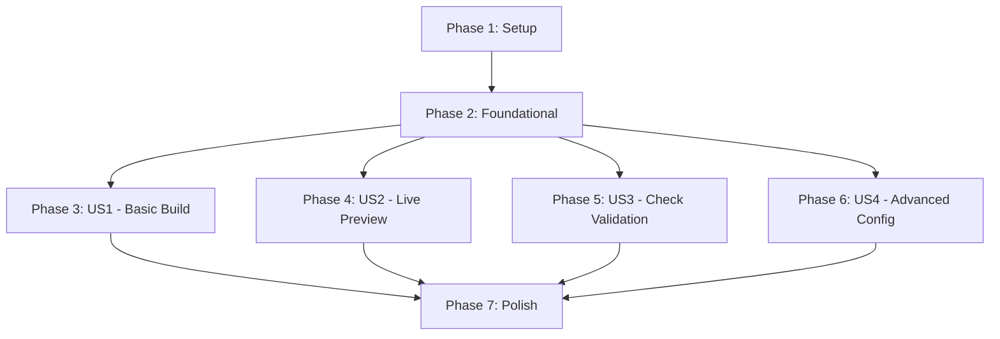

# Tasks: FairDM-Docs CLI Tool

**Input**: Design documents from `/specs/002-cli-tool/`
**Prerequisites**: plan.md, spec.md, research.md, data-model.md, contracts/

**Organization**: Tasks are grouped by user story to enable independent implementation and testing of each story.

## Format: `[ID] [P?] [Story] Description`

- **[P]**: Can run in parallel (different files, no dependencies)
- **[Story]**: Which user story this task belongs to (e.g., US1, US2, US3, US4)
- Include exact file paths in descriptions

---

## Phase 1: Setup (Shared Infrastructure)

**Purpose**: Project initialization and CLI framework setup

**Tasks**:
- [x] T001 Add Typer dependency (^0.12.0) to pyproject.toml dependencies
- [x] T002 Add tomli dependency for Python 3.10 compatibility to pyproject.toml dependencies
- [x] T003 Add CLI entry point script "fairdm-docs" to pyproject.toml [tool.poetry.scripts] section
- [x] T004 Create fairdm_docs/cli.py module with Typer app initialization
- [x] T005 [P] Create fairdm_docs/config.py module for configuration loading
- [x] T006 [P] Create tests/fixtures/ directory for test pyproject.toml files
- [x] T007 [P] Create tests/fixtures/minimal_pyproject.toml with minimal config
- [x] T008 [P] Create tests/fixtures/custom_config_pyproject.toml with custom settings
- [x] T009 [P] Create tests/fixtures/invalid_config_pyproject.toml with invalid values
- [x] T010 [P] Create tests/fixtures/no_tool_section_pyproject.toml without [tool.fairdm.docs]

**Test Criteria**: CLI package structure is set up, dependencies added, entry point registered, test fixtures ready

---

## Phase 2: Foundational (Blocking Prerequisites)

**Purpose**: Configuration loading and validation that all user stories depend on

**Tasks**:
- [x] T011 Implement BuildConfiguration dataclass in fairdm_docs/config.py with fields: source_dir, build_dir, port, verbosity
- [x] T012 Implement load_pyproject() function in fairdm_docs/config.py to find and parse pyproject.toml
- [x] T013 Implement load_config() function in fairdm_docs/config.py to extract [tool.fairdm.docs] section and merge with defaults
- [x] T014 Implement validate_config() function in fairdm_docs/config.py with validation rules from data-model.md
- [x] T015 Implement error message constants in fairdm_docs/config.py (ERROR_MESSAGES dict) per data-model.md
- [x] T016 Add ConfigError exception class in fairdm_docs/config.py for configuration validation failures
- [x] T017 Create tests/test_config.py with test class TestConfigurationLoading
- [x] T018 Add test_load_config_with_defaults in tests/test_config.py (no user config case)
- [x] T019 Add test_load_config_with_custom_values in tests/test_config.py (user overrides)
- [x] T020 Add test_load_config_validates_source_dir in tests/test_config.py (missing source dir error)
- [x] T021 Add test_load_config_validates_port_range in tests/test_config.py (invalid port error)
- [x] T022 Add test_load_config_validates_verbosity in tests/test_config.py (invalid verbosity error)
- [x] T023 Add test_no_pyproject_raises_error in tests/test_config.py (missing pyproject.toml)
- [x] T024 Add test_user_config_overrides_defaults in tests/test_config.py (precedence check)

**Test Criteria**: Configuration can be loaded from pyproject.toml, validated correctly, merged with defaults, and all validation rules enforce constraints

---

## Phase 3: User Story 1 - Basic Documentation Build (Priority: P1)

**Goal**: A documentation contributor can build Sphinx documentation with zero configuration using a single command

**Independent Test Criteria**: 
- Running `fairdm-docs build` in a project with docs/ directory generates HTML in docs/_build/html
- Command uses package's built-in conf.py without requiring user conf.py
- Clear errors shown when source directory missing or pyproject.toml not found

**Tasks**:
- [x] T025 [US1] Implement build() command function in fairdm_docs/cli.py with Typer decorator
- [x] T026 [US1] Add command signature with live parameter (bool, default=False) in fairdm_docs/cli.py build()
- [x] T027 [US1] Implement configuration loading call in build() function (load_config())
- [x] T028 [US1] Implement Sphinx build invocation using sphinx.cmd.build.main() in build() function
- [x] T029 [US1] Add Sphinx command-line arguments: -b html, source_dir, build_dir, -c fairdm_docs/ in build()
- [x] T030 [US1] Implement verbosity flag mapping (full/quiet/errors-only) to Sphinx -v/-q flags in build()
- [x] T031 [US1] Add error handling for ConfigError exceptions with user-friendly output in build()
- [x] T032 [US1] Add progress messages ("Building documentation...", "Build complete!") in build()
- [x] T033 [US1] Add exit code handling that returns Sphinx's exit code in build()
- [x] T034 [US1] Create tests/test_cli.py with test class TestBuildCommand
- [x] T035 [US1] Add test_build_with_defaults in tests/test_cli.py using CliRunner
- [x] T036 [US1] Add test_build_creates_output_directory in tests/test_cli.py (verifies HTML generated)
- [x] T037 [US1] Add test_build_displays_progress_messages in tests/test_cli.py (output verification)
- [x] T038 [US1] Add test_build_exits_zero_on_success in tests/test_cli.py (exit code check)
- [x] T039 [US1] Add test_build_error_when_no_pyproject in tests/test_cli.py (error message validation)
- [x] T040 [US1] Add test_build_error_when_source_missing in tests/test_cli.py (missing docs/ error)

**Completion Criteria**: User Story 1 acceptance scenarios all pass, basic build works with zero config

---

## Phase 4: User Story 2 - Live Preview Server (Priority: P2)

**Goal**: A documentation author can preview changes in real-time with a single flag

**Independent Test Criteria**:
- Running `fairdm-docs build --live` starts sphinx-autobuild server on port 5000
- Port conflict detected and reported with configuration guidance
- Server handles Ctrl+C gracefully and releases port

**Tasks**:
- [x] T041 [US2] Implement is_port_available() helper function in fairdm_docs/cli.py to check port availability
- [x] T042 [US2] Add port availability check in build() function before starting live server
- [x] T043 [US2] Implement sphinx-autobuild subprocess invocation in build() when live=True
- [x] T044 [US2] Add sphinx-autobuild arguments: --port, --open-browser, source_dir, build_dir in live server code
- [x] T045 [US2] Implement signal handler for graceful shutdown (Ctrl+C) in build() live mode
- [x] T046 [US2] Add live server startup message with port and URL in build()
- [x] T047 [US2] Add port conflict error handling with config guidance message in build()
- [x] T048 [US2] Add test_build_live_starts_server in tests/test_cli.py (mock subprocess)
- [x] T049 [US2] Add test_build_live_checks_port_availability in tests/test_cli.py
- [x] T050 [US2] Add test_build_live_error_when_port_occupied in tests/test_cli.py (port conflict)
- [x] T051 [US2] Add test_build_live_uses_custom_port_from_config in tests/test_cli.py

**Completion Criteria**: User Story 2 acceptance scenarios all pass, live preview works with auto-reload

---

## Phase 5: User Story 3 - Documentation Validation (Priority: P3)

**Goal**: A documentation maintainer can validate documentation for broken links before publishing

**Independent Test Criteria**:
- Running `fairdm-docs check` executes Sphinx linkcheck builder
- Broken links reported with file location and error details
- Command exits with code 0 when no errors, code 1 when errors found

**Tasks**:
- [x] T052 [US3] Implement check() command function in fairdm_docs/cli.py with Typer decorator
- [x] T053 [US3] Implement configuration loading in check() function (reuse load_config())
- [x] T054 [US3] Implement Sphinx linkcheck invocation using sphinx.cmd.build.main() with -b linkcheck in check()
- [x] T055 [US3] Add linkcheck output parsing to extract broken links from output.txt in check()
- [x] T056 [US3] Implement validation result formatting (file, line, URL, error) in check()
- [x] T057 [US3] Add success message when no broken links found in check()
- [x] T058 [US3] Add error summary with count of broken links in check()
- [x] T059 [US3] Set exit code to 0 for success, 1 for validation errors in check()
- [x] T060 [US3] Create test class TestCheckCommand in tests/test_cli.py
- [x] T061 [US3] Add test_check_passes_with_no_errors in tests/test_cli.py (all valid links)
- [x] T062 [US3] Add test_check_reports_broken_links in tests/test_cli.py (broken link detection)
- [x] T063 [US3] Add test_check_exits_zero_on_success in tests/test_cli.py
- [x] T064 [US3] Add test_check_exits_one_on_errors in tests/test_cli.py
- [x] T065 [US3] Add test_check_displays_file_and_line_numbers in tests/test_cli.py (output format)

**Completion Criteria**: User Story 3 acceptance scenarios all pass, link validation works correctly

---

## Phase 6: User Story 4 - Advanced Configuration (Priority: P4)

**Goal**: An advanced user can customize build behavior through pyproject.toml configuration

**Independent Test Criteria**:
- Custom build_dir setting works (output appears in specified directory)
- Custom source_dir setting works (reads from specified directory)
- Custom port setting works (live server uses specified port)
- Custom verbosity setting works (Sphinx output level adjusted)
- Invalid configuration values trigger clear validation errors

**Tasks**:
- [x] T066 [P] [US4] Add test_build_with_custom_build_dir in tests/test_cli.py
- [x] T067 [P] [US4] Add test_build_with_custom_source_dir in tests/test_cli.py
- [x] T068 [P] [US4] Add test_build_live_with_custom_port in tests/test_cli.py
- [x] T069 [P] [US4] Add test_build_with_verbosity_quiet in tests/test_cli.py
- [x] T070 [P] [US4] Add test_build_with_verbosity_errors_only in tests/test_cli.py
- [x] T071 [P] [US4] Add test_config_validation_error_message_format in tests/test_cli.py
- [x] T072 [P] [US4] Add test_invalid_port_shows_clear_error in tests/test_cli.py
- [x] T073 [P] [US4] Add test_invalid_verbosity_shows_clear_error in tests/test_cli.py

**Completion Criteria**: User Story 4 acceptance scenarios all pass, all configuration options work correctly

---

## Phase 7: Polish & Cross-Cutting Concerns

**Purpose**: Documentation, examples, and final integration

**Tasks**:
- [x] T074 [P] Update README.md with CLI usage section (installation, basic commands)
- [x] T075 [P] Add CLI command examples to README.md (build, build --live, check)
- [x] T076 [P] Add configuration examples to README.md ([tool.fairdm.docs] section)
- [x] T077 [P] Create examples/cli_usage.md with comprehensive CLI examples
- [x] T078 [P] Add troubleshooting section to README.md (common errors, solutions)
- [x] T079 Run poetry install to verify entry point registration works
- [x] T080 Manual test: Run fairdm-docs build in test project to verify end-to-end flow
- [x] T081 Manual test: Run fairdm-docs build --live to verify live server works
- [x] T082 Manual test: Run fairdm-docs check to verify validation works
- [x] T083 Manual test: Test error scenarios (no pyproject.toml, port conflict, missing source)
- [x] T084 Update CHANGELOG.md with new CLI feature entry

**Test Criteria**: All documentation updated, manual testing confirms everything works, package can be installed and CLI entry point works

---

## Dependencies Between User Stories



**Critical Path**: Setup → Foundational → US1 (Basic Build)

**Parallel Opportunities**:
- After Foundational phase completes: US1, US2, US3, US4 can all be developed independently
- Within Phase 1: T006-T010 (fixture creation) can run in parallel
- Within Phase 2: T017-T024 (test creation) can happen while implementation is ongoing
- Within Phase 7: T074-T078 (documentation tasks) can all run in parallel

**User Story Independence**:
- **US1** (Basic Build): Standalone, only depends on Foundational
- **US2** (Live Preview): Extends US1's build() function but can be developed independently by adding conditional logic
- **US3** (Check Validation): Completely separate command, only depends on Foundational
- **US4** (Advanced Config): Tests existing configuration system, no new code needed

---

## Implementation Strategy

### MVP Scope (Phase 1-3)

The minimum viable product consists of:
- **Phase 1**: Setup (T001-T010) - Dependencies and structure
- **Phase 2**: Foundational (T011-T024) - Configuration loading
- **Phase 3**: US1 Basic Build (T025-T040) - Core build command

**MVP Delivery**: After completing Phase 3, users can run `fairdm-docs build` to build documentation with zero configuration. This is the core value proposition.

### Incremental Delivery

After MVP, deliver in priority order:
1. **Phase 4**: US2 Live Preview (T041-T051) - Adds `--live` flag
2. **Phase 5**: US3 Validation (T052-T065) - Adds `check` command
3. **Phase 6**: US4 Advanced Config (T066-T073) - Validates customization works
4. **Phase 7**: Polish (T074-T084) - Documentation and final testing

Each phase delivers independently testable functionality.

### Parallel Execution Examples

**During Setup Phase**:
```bash
# Can run in parallel after T005 completes:
git checkout -b feature/test-fixtures
# Work on T006-T010 simultaneously
```

**During Foundational Phase**:
```bash
# Developer 1: Implementation (T011-T016)
git checkout -b feature/config-loader

# Developer 2: Tests (T017-T024) - can start after T011-T016 interfaces defined
git checkout -b feature/config-tests
```

**After Foundational Phase**:
```bash
# All user stories can be developed in parallel:
git checkout -b feature/us1-basic-build      # T025-T040
git checkout -b feature/us2-live-preview     # T041-T051
git checkout -b feature/us3-validation       # T052-T065
git checkout -b feature/us4-advanced-config  # T066-T073
```

---

## Task Summary

- **Total Tasks**: 84
- **Phase 1 (Setup)**: 10 tasks (5 parallelizable)
- **Phase 2 (Foundational)**: 14 tasks (8 test tasks)
- **Phase 3 (US1)**: 16 tasks (7 test tasks)
- **Phase 4 (US2)**: 11 tasks (4 test tasks)
- **Phase 5 (US3)**: 14 tasks (6 test tasks)
- **Phase 6 (US4)**: 8 tasks (all parallelizable test tasks)
- **Phase 7 (Polish)**: 11 tasks (5 parallelizable documentation tasks)

**Parallel Opportunities**: 23 tasks marked with [P] can run independently
**Test Coverage**: 33 test tasks ensuring quality across all user stories
**MVP Task Count**: 40 tasks (Phases 1-3)

---

## Validation Checklist

### Format Validation
✅ All tasks use checkbox format: `- [ ]`
✅ All tasks have sequential IDs (T001-T084)
✅ User story tasks have [Story] labels (US1, US2, US3, US4)
✅ Parallelizable tasks marked with [P]
✅ All tasks include file paths in descriptions

### Completeness Validation
✅ All 4 user stories from spec.md have dedicated phases
✅ Each user story has independent test criteria
✅ All functional requirements (FR-001 to FR-023) mapped to tasks
✅ All entities from data-model.md have implementation tasks
✅ Configuration schema fully implemented
✅ Error taxonomy from data-model.md covered

### Quality Validation
✅ MVP clearly defined (Phases 1-3)
✅ Dependencies documented with diagram
✅ Parallel execution examples provided
✅ Task count per phase documented
✅ Each phase has completion criteria
